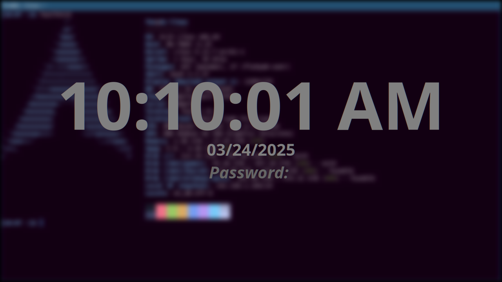

# DownLock - Zero Config Wayland screenlocker

_Nb: This primarily exists for my own learning of Zig and Wayland; but if you find it useful, amazing!_

DownLock is a zero-configuration screenlocker for Wayland.
It is compatible with compositors that support the ext-session-lock-v1 and wlr-screencopy-unstable-v1 protocols.



_(DownLock will use your locale for the time, date, prompt and responses)_

---

## Building

Dependencies:

- zig 0.14
- wayland
- wayland-protocols
- wlr-protocols
- xkbcommon
- pam
- pangocairo

Build and install:

```sh
zig build --release=safe install
sudo cp ./zig-out/bin/downlock /usr/local/bin/
```

## Usage

Just run `downlock`, there is no configuration!

